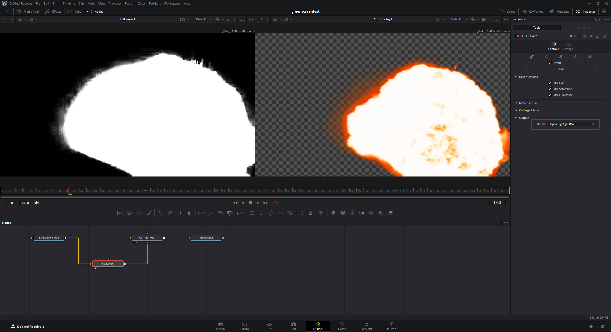

# CorridorKey for DaVinci Resolve User Guide

This guide covers installing and using the CorridorKey OpenFX plugin in DaVinci Resolve.

CorridorKey is exposed to Resolve as an OpenFX keying effect named **CorridorKey**. It uses the image connected to the effect plus an optional **AlphaHint** input. For best results, generate the AlphaHint with another keyer first, then let CorridorKey refine the matte and produce the final keyed image.

## Installation

The plugin is currently distributed as a `.7z` archive containing `CorridorKeyResolve.ofx.bundle`.

1. Close DaVinci Resolve.
2. Extract the `.7z` archive. If you cannot open it with OS-native tools, you can download it from https://7-zip.org/. 
3. Copy the extracted folder named `CorridorKeyResolve.ofx.bundle` into the system OpenFX plugin folder:

   ```text
   C:\Program Files\Common Files\OFX\Plugins\
   ```

   The final path should look like this:

   ```text
   C:\Program Files\Common Files\OFX\Plugins\CorridorKeyResolve.ofx.bundle
   ```

4. Start DaVinci Resolve.

The bundle is expected to contain the OFX plugin plus its bundled CorridorKey runtime under:

```text
CorridorKeyResolve.ofx.bundle\Contents\Resources\corridorkey-runtime
```

Do not move files out of the bundle. Resolve loads the `.ofx` binary from the bundle, and the plugin launches the bundled worker runtime from `Contents\Resources`.

## Enabling the Plugin in Resolve

After installation, Resolve should scan the OpenFX folder when it starts. The plugin should appear in Fusion -> Right-click -> Add tool -> Keying. 

If the plugin does not appear:

- Click the Davinci Resolve menu -> Preferences -> Video Plugins. Even if something's wrong, it should show up there.
- Confirm the bundle folder is directly inside `C:\Program Files\Common Files\OFX\Plugins`.
- Confirm the folder (including the `.ofx.bundle` ending) is present, and contains a folder called `Contents` as its first subfolder.
- Restart Resolve after copying the bundle.
- If Resolve cached a failed scan, close Resolve and remove its OFX plugin cache (found in `%appdata%\Blackmagic Design\DaVinci Resolve\Support\`), then start Resolve again.

## Basic Workflow

CorridorKey is designed to run after a faster, conventional keyer creates a rough alpha matte.

1. Add your greenscreen or bluescreen clip to the timeline.
2. Go to the Fusion tab
3. Add a standard keying effect for the rough shape, eg. HSL Key.
4. Set the Standard key to output a B+W matte
5. Add the Corridor Key 
6. Connect the nodes as follows: Image into both keys, output of the standard key effect into the AlphaHint input of CorridorKey



> [!NOTE]
> * CorridorKey takes a hot second to initialize, as there's an entire AI framework that's getting loaded in. It may seem like it's not working for a while – just wait.
> * The default inference size window is set to 512, which is quite low and best suited for previews. You can turn this up in the effect settings before the final render. 

## Using the Plugin

In the Fusion page, CorridorKey behaves like an OpenFX node. Connect the source image and, when available, the AlphaHint input. In the Edit or Color page, apply it like any other OpenFX effect, but use a Fusion setup if you need explicit control over the AlphaHint connection.

The first render can take longer because the bundled Python worker and CorridorKey model need to start. Later frames should reuse the loaded worker while the plugin instance remains active.

If Resolve appears to stall on first use, check the plugin log:

```text
C:\tmp\CorridorKeyResolve.log
```

The log includes worker startup, render requests, elapsed time, and worker errors.

## Controls

### Screen Color

Selects the screen color CorridorKey should expect.

- **Auto**: Detects whether the shot is closer to green screen or blue screen.
- **Green**: Use for greenscreen footage.
- **Blue**: Use for bluescreen footage.

Use a fixed value when Auto chooses the wrong screen color or when you want consistent behavior across shots.

### Input Colorspace

Describes how the incoming image data should be interpreted.

- **sRGB**: Use for typical display-referred footage or standard Resolve node setups.
- **Linear**: Use when the image has already been converted to linear light before CorridorKey.

Use the setting that matches the data being fed into the node.

### Output Mode

Selects what CorridorKey writes back to Resolve.

- **Processed RGBA**: Final keyed image with alpha. This is the normal output.
- **Matte**: The full CorridorKey matte as an image.
- **Straight FG**: The foreground with straight alpha.
- **Checker Comp**: A checkerboard composite for inspecting edges and transparency.

Use **Matte** while tuning the key, then switch back to **Processed RGBA** for final compositing.

### Despill

Controls how strongly the plugin removes green or blue spill from the foreground.

- `0`: No despill.
- `5`: Default moderate despill.
- `10`: Maximum despill.

Increase this when screen color contaminates hair, edges, clothing, or reflective areas. Reduce it if foreground colors start looking unnatural.

### Auto Despeckle

Enables automatic cleanup of small matte defects.

Leave this enabled for most shots. Disable it if the matte cleanup removes fine foreground detail that you want to keep.

### Despeckle Size

Controls the scale of speckle cleanup.

Higher values remove larger isolated matte defects. Lower values preserve more small detail. If fine details disappear, reduce this value or disable **Auto Despeckle**.

### Refiner

Controls how strongly CorridorKey refines the matte.

The default is `1.0`. Increase it when the matte needs stronger refinement. Reduce it when the result becomes too aggressive around edges or semi-transparent detail.

### Inference Size

Controls the model resolution used by CorridorKey.

- **512**: Default. Fastest and recommended for setup, previews, and most first passes.
- **1024**: More detail, slower.
- **2048**: Highest detail, slowest and most memory intensive.

Start with `512`. Move to `1024` or `2048` only after the key is set up and you need higher-quality edges for final output.

### Backend

Selects the CorridorKey backend.

- **Auto**: Recommended. Lets the worker choose the appropriate backend.
- **Torch**: Uses the PyTorch backend.
- **MLX**: Intended for Apple Silicon systems.

On Windows with NVIDIA GPUs, use **Auto** or **Torch**.

### Device

Selects the compute device.

- **Auto**: Recommended. Uses CUDA when available, otherwise falls back as needed.
- **CUDA**: NVIDIA GPU.
- **MPS**: Apple GPU path.
- **CPU**: CPU rendering.
- **ROCm**: AMD ROCm path where supported.

For an NVIDIA GPU, use **Auto** or **CUDA**. CPU rendering can be much slower, especially at higher inference sizes.

## Practical Tuning Order

1. Build a rough key first and connect it to **AlphaHint**.
2. Set **Output Mode** to **Matte**.
3. Confirm **Screen Color**.
4. Tune the upstream keyer until the AlphaHint describes the subject clearly.
5. Tune **Despeckle Size** and **Refiner**.
6. Switch **Output Mode** to **Processed RGBA**.
7. Adjust **Despill** while viewing the image over the intended background.
8. Increase **Inference Size** for final quality only if needed.

## Troubleshooting

### The plugin does not appear in Resolve

Check that the installed path is:

```text
C:\Program Files\Common Files\OFX\Plugins\CorridorKeyResolve.ofx.bundle
```

Then restart Resolve. The plugin appears under **Open FX > Keying > CorridorKey**.

### The plugin appears but render fails

Check:

```text
C:\tmp\CorridorKeyResolve.log
```

Common causes are missing runtime files inside the bundle, GPU/runtime dependency problems, or a bad AlphaHint connection.

### The first frame is very slow

The first frame may include worker startup and model loading. Use **Inference Size 512** while setting up the shot.

### CUDA is not being used

Set **Device** to **Auto** or **CUDA**. If the log still shows CPU fallback, confirm that the distributed archive was built with CUDA support and that the NVIDIA driver is installed.

